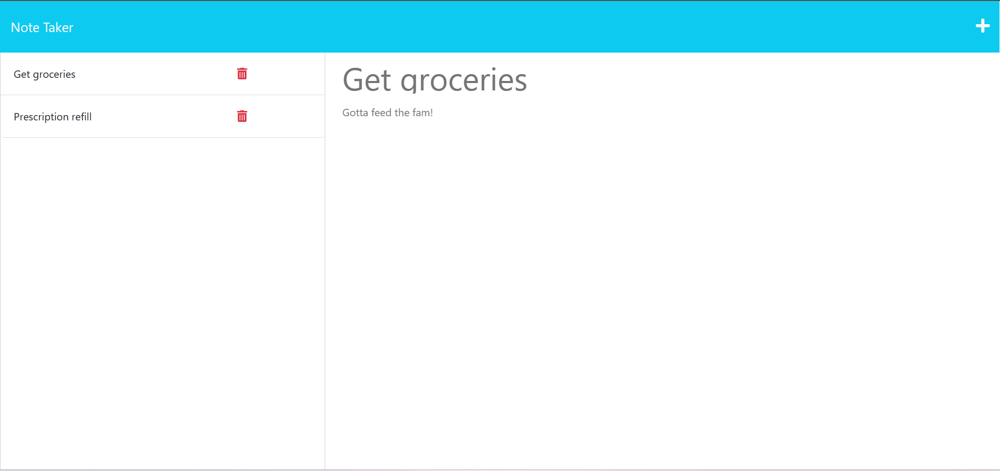

# Express.js Challenge: Note Taker

Deployed app: https://notetaker-1919-40d80324c454.herokuapp.com/ 

A basic full-stack app that allows users to save notes, consisting of just a title and a description, to a server deployed using Heroku. The notes persist, even when reloading, until the server restarts.

The app uses the `express` npm package to serve the homepage, notes page, and to query a `db.json` file containg the saved notes.